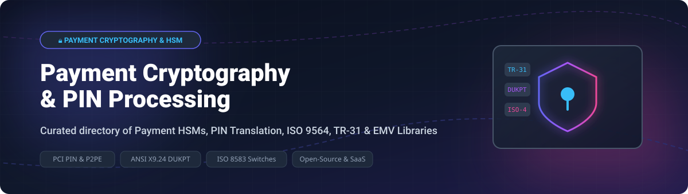

  

# 💳 Awesome Payment Cryptography & PIN Processing 🔐

> **The definitive curated directory of commercial Payment HSMs, cloud payment cryptography services, PIN block translation modules, and open-source payment security software.**

---

## 📌 Ecosystem Overview & Market Dynamics 📈

The global **Payment Hardware Security Module (HSM) and Payment Cryptography Market** was valued at approximately **\$1.2 Billion in 2025** and is projected to expand to **\$2.5 Billion by 2032**, growing at a **CAGR of ~11.4%**. 

**Market Concentration & Structure:**
- **Market Structure:** **Highly Concentrated (Dominant Oligopoly)**.
- **Key Characteristics:** High barriers to entry due to stringent PCI HSM, FIPS 140-3 Level 3/4, and scheme certifications (Visa, Mastercard, Amex).
- **Dominant Leaders:** Thales (payShield), Utimaco (Atalla), and Futurex control over **80% of enterprise card issuance and acquiring HSM deployments globally**.
- **Cloud Evolution:** Hyperscalers (AWS Payment Cryptography) and hybrid HSM-as-a-Service (VirtuCrypt, MYHSM) are capturing next-generation cloud-native fintech workloads.

---

## 📑 Table of Contents 🔍

- [☁️ SaaS & Hosted Payment Cryptography Platforms](#-saas--hosted-payment-cryptography-platforms)
- [💻 Open-Source GitHub Projects](#-open-source-github-projects)
- [🤝 How to Contribute](#-how-to-contribute)
- [💖 Support & Sponsorship](#-support--sponsorship)
- [⚠️ Security & Compliance Disclaimer](#️-security--compliance-disclaimer)
- [🌟 Star History](#-star-history)

---

## ☁️ SaaS & Hosted Payment Cryptography Platforms 🚀

| Product / Platform 🏢 | Enterprise Size / Valuation 📊 | Starting Tier Pricing 💰 | Free Tier / Trial Limit 🎁 | Primary Use Case & Security Profile 🔐 |
| :--- | :--- | :--- | :--- | :--- |
| **[FIS Global](https://www.fisglobal.com/)** | **\$58.4 Billion** Valuation | \$5,000 / month (Enterprise Core Gateway) | 30-day sandbox trial (test card accounts) | Enterprise issuer & acquirer PIN switching, tokenization, & processing switch. |
| **[Fiserv PIN Pad Solutions](https://www.fiserv.com/)** | **\$92.1 Billion** Valuation | \$150 / merchant terminal / month | 14-day merchant integration test suite | Merchant acquiring, PIN pad key management, and P2PE encryption. |
| **[Worldline Cryptographic Services](https://worldline.com/)** | **\$3.2 Billion** Valuation | €1,200 / month (Hosted Security Module) | 30-day developer portal API sandbox | European payment infrastructure, PIN block translation, & HSM hosting. |
| **[AWS Payment Cryptography](https://aws.amazon.com/payment-cryptography/)** | **\$2.3 Trillion** Market Cap (Amazon) | \$0.95 / hour per active key + \$0.0001 per API call | 2-month free trial (up to 1,000 key operations/mo) | AWS-native payment HSM, PIN translation, CVV generation, & EMV processing. |
| **[Thales payShield (Cloud & HSM)](https://cpl.thalesgroup.com/encryption/payshield-10k)** | **€34.8 Billion** Market Cap | \$25,000 (Base Hardware HSM unit) | 30-day virtual payShield simulator for partner devs | Dominant payment HSM globally. PCI HSM v3 & FIPS 140-3 Level 3 certified. |
| **[Euronet Electronic Payment Services](https://www.euronet.com/)** | **\$5.1 Billion** Market Cap | \$2,500 / month (Network Switch Interface) | 30-day network integration test environment | Global ATM/POS transaction processing & cryptographic PIN routing. |
| **[TSYS (Global Payments)](https://www.tsys.com/)** | **\$26.7 Billion** Market Cap | \$3,500 / month (Issuer Cryptography Suite) | 30-day API sandbox environment | Issuer/acquirer transaction processing, PIN verification, & card tokenization. |
| **[Utimaco Atalla HSM](https://utimaco.com/)** | **\$1.2 Billion** Estimated Valuation | \$18,000 (Hardware Unit) | 30-day software evaluation SDK & emulator | Enterprise payment HSM for card issuing & acquiring with legacy Atalla commands. |
| **[Futurex VirtuCrypt](https://www.futurex.com/)** | **\$450 Million** Estimated Valuation | \$1,499 / month (VirtuCrypt HSMaaS) | 30-day cloud trial (up to 5,000 test cryptographic calls) | Hybrid cloud HSMaaS, TR-31/TR-34 key management, & post-quantum (PQC) crypto. |
| **[MYHSM by Utimaco](https://www.myhsm.com/)** | **\$150 Million** Estimated Valuation | \$995 / month (Shared Cloud HSM Slot) | 14-day test environment (10,000 free operations) | OPEX-based PCI PIN & PCI DSS compliant cloud payment HSM service. |

---

## 💻 Open-Source GitHub Projects 🛠️

*Open-source libraries provide powerful primitives for ISO 8583 messaging, DUKPT key derivation, PIN block encoding (ISO 9564), and TR-31 key wrapping. **Note:** Production PIN translation requires certified PCI HSM hardware.*

### 🛠️ Payment Frameworks & Security Libraries

- **[jPOS](https://github.com/jpos/jPOS)**   
  **The de facto open-source payment switch framework (AGPL-3.0)**. 25+ years in production across acquirers, issuers, and gateways. Supports ISO 8583 protocol handling, ANS X9.24, software security modules, and HSM interfaces.

- **[moov-io/iso8583](https://github.com/moov-io/iso8583)**   
  **Modern High-Performance Go ISO 8583 Library (Apache-2.0)**. Efficient packing, unpacking, and formatting of financial transaction messages for cloud-native payment gateways.

- **[kpavlov/jreactive-8583](https://github.com/kpavlov/jreactive-8583)**   
  **ISO 8583 Client & Server for Netty/Java/Kotlin (Apache-2.0)**. Asynchronous, high-throughput financial message processing framework.

- **[rkbalgi/isosim](https://github.com/rkbalgi/isosim)**   
  **ISO 8583 Web Simulator in Go (MIT)**. Web-based simulator for ISO 8583 message testing, field inspection, and cryptographic payload verification.

- **[mrautio/emvpt](https://github.com/mrautio/emvpt)**   
  **Minimum Viable Payment Terminal (MIT)**. Open-source EMV L2 terminal implementation for payment acceptance testing and card reader debugging.

- **[sgbj/Dukpt.NET](https://github.com/sgbj/Dukpt.NET)**   
  **C# ANS X9.24 DUKPT Implementation (MIT)**. Handles Derived Unique Key Per Transaction (DUKPT) PIN block encryption and key derivation.

- **[Shopify/dukpt](https://github.com/Shopify/dukpt)**   
  **Ruby DUKPT Decryption Gem (MIT)**. Production-tested DUKPT ciphertext decrypter created by Shopify for point-of-sale integration.

- **[openemv/dukpt](https://github.com/openemv/dukpt)**   
  **ANSI X9.24 DUKPT C Library (MIT)**. Part of the OpenEMV suite for deriving unique per-transaction keys on POS terminals and ATMs.

- **[openemv/tr31](https://github.com/openemv/tr31)**   
  **ANSI X9.143 / TR-31 Key Block Library (MIT)**. Key block wrapping and unwrapping tools for secure key exchange in payment networks.

- **[SoftwareVerde/java-dukpt](https://github.com/SoftwareVerde/java-dukpt)**   
  **Java Triple DES & AES DUKPT Library (MIT)**. Lightweight DUKPT key engine for Android and Java payment terminals.

- **[aws-samples/samples-for-payment-cryptography-service](https://github.com/aws-samples/samples-for-payment-cryptography-service)**   
  **Official AWS Payment Cryptography Code Samples (MIT-0)**. Scripts and utilities for PIN translation, CVV generation, and TR-31 key export on AWS.

- **[paysec (Rust)](https://docs.rs/crate/paysec/0.0.2)**  
  **Rust Payment Security Library (GPL-3.0)**. Encodes and enciphers ISO 9564 Format 4 PIN blocks with AES binding PIN to PAN.

- **[psec (Python)](https://socket.dev/pypi/package/psec)**  
  **Python Payment Cryptography Package**. TR-31 key block wrapping, CVV generation, Triple DES/AES utilities, and ISO Format 4 PIN blocks.

- **[teqpace-services/isopace](https://github.com/teqpace-services/isopace)**   
  **Go Payment Cryptography Vault**. Software key storage with SealedVault, PIN encryptor for issuers, and PIN translator for acquirers.

- **[chuwuwang/learn-pos-tools](https://github.com/chuwuwang/learn-pos-tools)**   
  **POS Payment & Encryption Toolkit**. Lightweight helper scripts for ISO 8583 parsing, EMV tag extraction, and key operations.

---

## 🤝 How to Contribute 📝

1. Fork this repository.
2. Create a feature branch (`git checkout -b feature/new-crypto-tool`).
3. Add or edit entries maintaining the exact tabular/bullet formatting.
4. Ensure starting tier pricing, free limits, company sizes, and Stars_Count links are populated.
5. Open a Pull Request with a clear summary of changes.

---

## 💖 Support & Sponsorship 🙏

Thank you for exploring and utilizing this curated directory! If this repository has helped you or your engineering team in understanding payment cryptography, HSM architecture, or PIN processing implementations, please consider supporting the project:

- 🌟 **Star** this repository on GitHub to increase its visibility.
- 🍴 **Fork** and contribute new tools, libraries, or architectural guides.
- 📢 **Share** it with your fellow payment security engineers, architects, and fintech developers.
- ☕ **Buy me a coffee / Sponsor**: If you'd like to support ongoing research and open-source curation, visit my [GitHub Sponsor Dashboard](https://github.com/sponsors/ishandutta2007).

---

## ⚠️ Security & Compliance Disclaimer 🔒

- **PCI PIN & P2PE Compliance:** Production PIN block translation, PIN verification, and Zone PIN Key (ZPK) handling require certified hardware (PCI HSM v3+ / FIPS 140-3 Level 3). Software vaults (e.g., `jPOS` software security module or Go `SealedVault`) are strictly for **development, sandbox testing, and non-PIN cryptographic functions**.
- **Atomic PIN Translation:** Under PCI PIN rules, clear-text PINs must **never exist in host memory**. PIN translation must occur atomically inside the HSM security boundary.
- **TDES Phase-out:** Legacy Fixed TDES PIN keys are prohibited by major card schemes — implementation must use **AES DUKPT (ISO 9564 Format 4)** or **AES Key Blocks (TR-31 / ANSI X9.143)**.

---

## 🌟 Star History

---

  <b>Built with ❤️ for payment engineers, security architects, &amp; fintech developers worldwide.</b>

